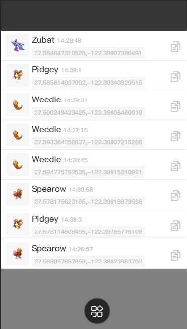
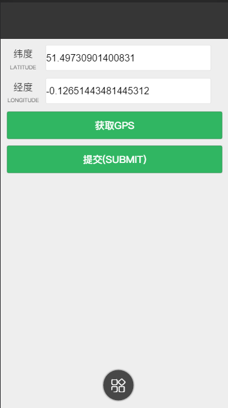

###Pokemon-GO around finder
##!!!this project is no longer to useable 

###get start

run templates> mainlist.html in browser

change ajax api url with your host

```javascript
  url:'http://k186studio.com/pokemon?type=1&lat='+PokemoData.Lat+'&lng='+PokemoData.Lng
```
at 
```$xslt
js > main.js 51
```
demo json
```$xslt
demo data in php>moke.json 
```
result






### thanks  [Pokevision](https://pokevision.com/map/)